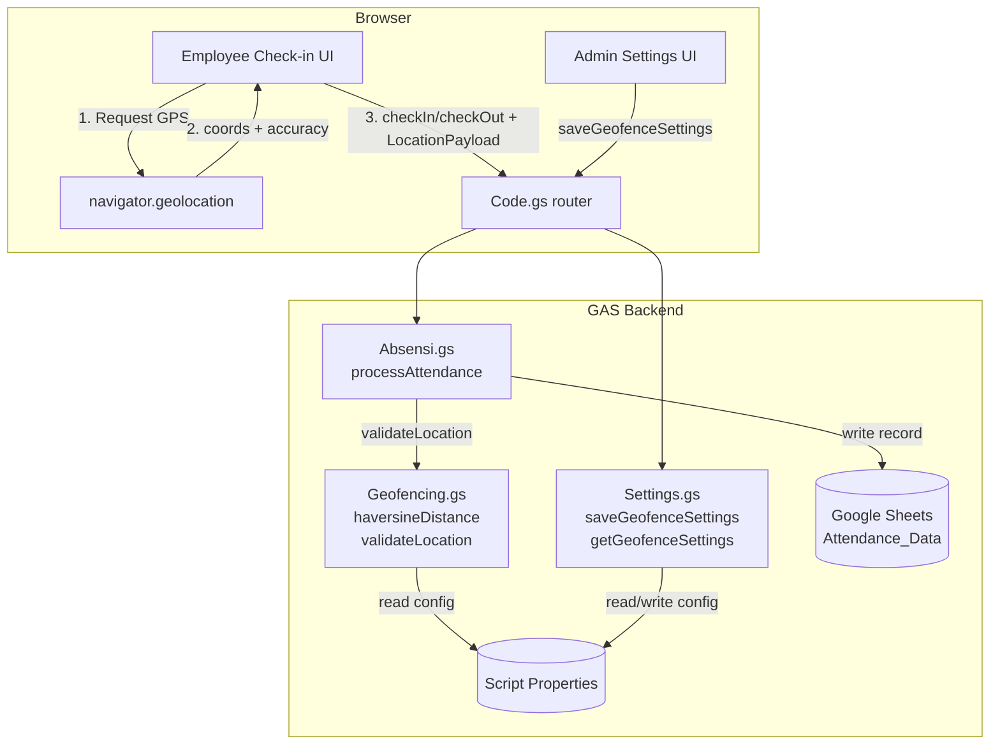

# Design Document: Geofencing Feature

## Overview

The Geofencing feature adds location-based validation to the attendance system. It integrates with the existing `processAttendance` flow in `Absensi.gs`, extends the admin Settings page with a geofence configuration section, and surfaces real-time location status feedback in the employee check-in/check-out UI.

The design follows the existing architectural patterns of the project:
- Backend logic lives in `.gs` files; new functions are added to `Settings.gs` (admin config) and `Absensi.gs` (validation).
- A new `Geofencing.gs` file houses the Haversine distance computation and location validation logic, keeping concerns separated.
- Frontend components (`Settings.js`, employee check-in UI) are extended in-place using the existing vanilla JS component pattern.
- Configuration is persisted in Google Apps Script **Script Properties** (consistent with how `ORGANIZATION_NAME`, `DEFAULT_LANGUAGE`, etc. are stored today).
- Attendance data is stored in Google Sheets via `SpreadsheetApp`, with new columns appended to `Attendance_Data`.

### Key Design Decisions

| Decision | Rationale |
|---|---|
| Single global Work_Location | Simplest model; no per-shift or per-employee complexity |
| Button hidden (not disabled) when outside geofence | Prevents confusion — a disabled button implies the action exists but is blocked; hiding it makes the state unambiguous |
| Accuracy threshold of 200 m hard-blocks submission | Inaccurate GPS could falsely pass or fail the geofence check; blocking is safer than allowing a potentially fraudulent submission |
| Haversine formula on the backend | Prevents client-side spoofing; the server is the authoritative validator |
| Admin manual entries bypass geofence | Admins need to correct records regardless of their own location |
| Location data stored per attendance record | Enables audit trail without requiring a separate sheet |
| `GEOFENCE_ENABLED` flag in Script Properties | Allows toggling enforcement without deleting the saved coordinates |

---

## Architecture

The feature spans three layers: frontend (browser), GAS backend, and Google Sheets storage.



### Data Flow: Employee Check-In

1. Employee opens check-in view → frontend calls `navigator.geolocation.getCurrentPosition`.
2. On success, frontend computes nothing — it passes raw `{ latitude, longitude, accuracy }` to the backend.
3. Frontend hides the button if `accuracy > 200` or if geolocation fails.
4. Employee clicks the (now-visible) button → frontend calls `google.script.run.checkIn(token, locationPayload)`.
5. `processAttendance` in `Absensi.gs` calls `validateLocation(locationPayload)` in `Geofencing.gs`.
6. `validateLocation` reads `GEOFENCE_ENABLED`, `WORK_LAT`, `WORK_LNG`, `GEOFENCE_RADIUS` from Script Properties, computes Haversine distance, and returns `{ valid, distance, radius }`.
7. If valid, the attendance record is written to Sheets with the location columns populated.
8. Response is returned to the frontend, which updates the UI.

---

## Components and Interfaces

### New File: `backend/Geofencing.gs`

This file owns all geofence math and validation logic.

```javascript
/**
 * Compute the great-circle distance between two lat/lng points using the
 * Haversine formula. Returns distance in meters.
 *
 * @param {number} lat1
 * @param {number} lng1
 * @param {number} lat2
 * @param {number} lng2
 * @returns {number} distance in meters
 */
function haversineDistance(lat1, lng1, lat2, lng2)

/**
 * Validate a submitted location payload against the configured geofence.
 * Returns early (valid=true, skipped=true) when geofencing is disabled.
 *
 * @param {{ latitude: number, longitude: number, accuracy: number }} payload
 * @returns {{ valid: boolean, skipped: boolean, distance: number, radius: number, error: string|null }}
 */
function validateLocation(payload)

/**
 * Validate that a lat/lng pair is numerically in range.
 * @param {number} lat
 * @param {number} lng
 * @returns {{ valid: boolean, error: string|null }}
 */
function validateLatLng(lat, lng)
```

### Modified: `backend/Settings.gs`

Two new exported functions:

```javascript
/**
 * Get current geofence configuration (admin only).
 * Returns { enabled, latitude, longitude, radius } or nulls if not configured.
 */
function getGeofenceSettings(token)

/**
 * Save geofence configuration (admin only).
 * Validates ranges, persists to Script Properties, logs activity.
 *
 * @param {string} token
 * @param {{ enabled: boolean, latitude: number, longitude: number, radius: number }} data
 */
function saveGeofenceSettings(token, data)
```

Script Properties keys used:

| Key | Type | Description |
|---|---|---|
| `GEOFENCE_ENABLED` | `"true"` / `"false"` | Master on/off toggle |
| `WORK_LAT` | numeric string | Work location latitude |
| `WORK_LNG` | numeric string | Work location longitude |
| `GEOFENCE_RADIUS` | numeric string | Allowed radius in meters |

### Modified: `backend/Absensi.gs`

`processAttendance(token, action, locationPayload)` gains a third parameter.

- When geofencing is enabled, calls `validateLocation(locationPayload)` before writing the record.
- On validation failure, returns `errorResponse` with distance and radius in the message.
- On success, appends location columns to the row written to `Attendance_Data`.

`processAttendanceByQR(employeeId, locationPayload)` gains a second parameter with the same semantics.

`saveManualAttendance` is **not** modified — it already bypasses geofence by design. A new `source` column value `"admin"` is written to distinguish manual entries.

### Modified: `src/frontend/components/Settings.js`

A new **Geofence Settings** card is added to the admin Settings page, rendered alongside the existing Organization and Language cards.

Key UI elements:
- Toggle switch: Enable / Disable geofencing
- Latitude input (numeric, −90 to 90)
- Longitude input (numeric, −180 to 180)
- Radius input (numeric, 10–50000 m)
- "Use My Current Location" button (calls `navigator.geolocation` to auto-fill lat/lng)
- Save button

### Modified: Employee Check-In UI (employee partial / `DailyAttendance.js` area)

The employee-facing check-in/check-out view gains:

- A **location status badge** (green "Within Zone" / red "Outside Zone" / yellow "Acquiring…" / grey "Location Error")
- Distance display when outside the geofence
- The clock-in/clock-out button is **hidden** (CSS `display: none`) when:
  - GPS accuracy > 200 m
  - Geolocation API returns an error
  - Computed distance > Geofence_Radius (this check happens client-side using the same Haversine math for UX, with the server as the authoritative validator)
- The button is **shown** when inside the geofence with sufficient accuracy, or when geofencing is disabled

---

## Data Models

### Script Properties (new keys)

```
GEOFENCE_ENABLED  = "true" | "false"
WORK_LAT          = "-6.200000"          // decimal degrees, string
WORK_LNG          = "106.816666"         // decimal degrees, string
GEOFENCE_RADIUS   = "200"               // meters, string
```

### Attendance_Data Sheet (extended columns)

The existing sheet has columns A–F:

| Col | Field |
|---|---|
| A | date |
| B | employeeId |
| C | checkInTime |
| D | checkInStatus |
| E | checkOutTime |
| F | checkOutStatus |

New columns added:

| Col | Field | Notes |
|---|---|---|
| G | checkInLat | Decimal degrees or `""` |
| H | checkInLng | Decimal degrees or `""` |
| I | checkInDistance | Meters (integer) or `""` |
| J | checkOutLat | Decimal degrees or `""` |
| K | checkOutLng | Decimal degrees or `""` |
| L | checkOutDistance | Meters (integer) or `""` |
| M | source | `"employee"` \| `"qr"` \| `"admin"` |

Backward compatibility: existing rows have empty strings in G–M. All read paths treat empty as "no location data" and display "N/A".

### Location Payload (frontend → backend)

```javascript
{
  latitude:  number,   // decimal degrees
  longitude: number,   // decimal degrees
  accuracy:  number    // meters (from Geolocation API)
}
```

### Validate Location Response (internal)

```javascript
{
  valid:    boolean,
  skipped:  boolean,   // true when geofencing is disabled
  distance: number,    // meters, 0 when skipped
  radius:   number,    // configured radius, 0 when skipped
  error:    string | null
}
```

### Geofence Settings (frontend ↔ backend)

```javascript
{
  enabled:   boolean,
  latitude:  number | null,
  longitude: number | null,
  radius:    number | null   // meters
}
```

---

## Correctness Properties

*A property is a characteristic or behavior that should hold true across all valid executions of a system — essentially, a formal statement about what the system should do. Properties serve as the bridge between human-readable specifications and machine-verifiable correctness guarantees.*

### Property 1: Haversine symmetry

*For any* two valid coordinate pairs (lat1, lng1) and (lat2, lng2), `haversineDistance(lat1, lng1, lat2, lng2)` SHALL equal `haversineDistance(lat2, lng2, lat1, lng1)`.

**Validates: Requirements 3.1**

### Property 2: Haversine self-distance is zero

*For any* valid coordinate (lat, lng), `haversineDistance(lat, lng, lat, lng)` SHALL return exactly 0.

**Validates: Requirements 3.1**

### Property 3: Coordinate range validation

*For any* latitude in [−90, 90] and longitude in [−180, 180], `validateLatLng` SHALL return `{ valid: true, error: null }`. *For any* latitude outside [−90, 90] or longitude outside [−180, 180], `validateLatLng` SHALL return `{ valid: false }` with a non-empty error string.

**Validates: Requirements 1.3, 1.4, 3.6**

### Property 4: Geofence boundary determines acceptance or rejection

*For any* work location (workLat, workLng), radius R, and employee location (empLat, empLng): if `haversineDistance(workLat, workLng, empLat, empLng) ≤ R` then `validateLocation` SHALL return `{ valid: true }`; if the distance exceeds R then `validateLocation` SHALL return `{ valid: false }` with the computed distance and configured radius included in the response. This property applies to both the standard check-in/check-out flow and the QR code attendance flow.

**Validates: Requirements 3.1, 3.2, 7.2**

### Property 5: Disabled geofence skips validation for all flows

*For any* location payload (including null, undefined, or malformed payloads), when `GEOFENCE_ENABLED` is `"false"`, `validateLocation` SHALL return `{ valid: true, skipped: true }`. This applies to the standard attendance flow, the QR attendance flow, and any other flow that calls `validateLocation`.

**Validates: Requirements 2.6, 3.5, 7.3**

### Property 6: Geofence settings round-trip

*For any* valid geofence configuration `{ enabled, latitude, longitude, radius }` (with latitude in [−90, 90], longitude in [−180, 180], radius in [10, 50000]), saving it via `saveGeofenceSettings` and then reading it back via `getGeofenceSettings` SHALL return an equivalent configuration with the same enabled state, latitude, longitude, and radius.

**Validates: Requirements 1.2, 1.6**

### Property 7: Toggling geofence enabled/disabled preserves coordinates

*For any* saved geofence configuration with latitude, longitude, and radius, toggling the `enabled` flag off and then back on via `saveGeofenceSettings` SHALL leave the latitude, longitude, and radius values unchanged in Script Properties.

**Validates: Requirements 1.7**

### Property 8: Invalid radius is rejected without side effects

*For any* radius value less than 10 or greater than 50,000, `saveGeofenceSettings` SHALL return an error response and SHALL NOT modify any Script Properties (the previously stored values, if any, remain unchanged).

**Validates: Requirements 1.5**

### Property 9: Location data is stored on every valid attendance record

*For any* valid location payload `{ latitude, longitude, accuracy }` that passes geofence validation, when a check-in or check-out is processed, the resulting attendance row in `Attendance_Data` SHALL contain the submitted latitude, longitude, and the computed distance from the Work_Location in the corresponding location columns (G–I for check-in, J–L for check-out).

**Validates: Requirements 3.4, 6.1, 6.2**

### Property 10: Admin manual entry bypasses geofence regardless of state

*For any* attendance record submitted via `saveManualAttendance`, regardless of whether geofencing is enabled or disabled and regardless of any location payload, the record SHALL be accepted and written to the sheet without geofence validation.

**Validates: Requirements 5.1, 5.2**

### Property 11: Admin manual entry stores source flag

*For any* attendance record created via `saveManualAttendance`, the stored row SHALL contain `"admin"` in the `source` column (column M), distinguishing it from employee-submitted records.

**Validates: Requirements 5.3**

### Property 12: Backward compatibility with pre-geofencing records

*For any* existing attendance record that has only columns A–F (no location columns), reading it via `getDailyAttendance` or `getDailyAttendanceRange` SHALL return the record without error, with empty strings or `null` for the location fields, and SHALL NOT alter the existing column values.

**Validates: Requirements 6.5**

---

## Error Handling

### Frontend Errors

| Scenario | Behavior |
|---|---|
| `navigator.geolocation` not supported | Hide clock-in/out button; show "Location services not supported by this browser." |
| Geolocation permission denied | Hide button; show "Location permission denied. Please allow location access and try again." |
| Geolocation position unavailable | Hide button; show "Unable to determine your location. Please check your GPS signal." |
| Geolocation timeout | Hide button; show "Location request timed out. Please try again." |
| Accuracy > 200 m | Hide button; show "GPS accuracy is insufficient (Xm). Please move to an open area and try again." |
| Outside geofence | Hide button; show distance badge and "You are Xm from the work location (max Ym allowed)." |
| Backend returns geofence error | Display the server error message; do not retry automatically |

### Backend Errors

| Scenario | Response |
|---|---|
| `locationPayload` missing when geofencing enabled | `errorResponse("Location data is required when geofencing is enabled.")` |
| `latitude` or `longitude` out of range | `errorResponse("Invalid coordinates: latitude must be between -90 and 90, longitude between -180 and 180.")` |
| Distance exceeds radius | `errorResponse("You are outside the allowed work zone. Distance: Xm, Allowed: Ym.")` |
| Script Properties not configured (geofencing enabled but no Work_Location) | `errorResponse("Geofence is enabled but work location has not been configured. Please contact your administrator.")` |
| Invalid radius on save | `errorResponse("Geofence radius must be between 10 and 50,000 meters.")` |
| Invalid lat/lng on save | `errorResponse("Latitude must be between -90 and 90.")` / `errorResponse("Longitude must be between -180 and 180.")` |

### Backward Compatibility

- Existing attendance records (columns A–F only) are read without error; G–M are treated as empty strings.
- `processAttendance` called without `locationPayload` when geofencing is disabled processes normally.
- The `source` column (M) defaults to `"employee"` for new records and `""` for old records; display logic treats `""` as "N/A".

---

## Testing Strategy

### Unit Tests (example-based)

Focus on specific scenarios and edge cases:

- `haversineDistance` with known coordinate pairs (e.g., two points 1 km apart)
- `validateLatLng` with boundary values: exactly −90, 90, −180, 180 (valid); −90.001, 90.001 (invalid)
- `validateLocation` when geofencing is disabled returns `skipped: true`
- `saveGeofenceSettings` rejects radius = 9 and radius = 50001
- `processAttendance` with a valid location payload writes location columns to the sheet
- `saveManualAttendance` writes `source = "admin"` and no location columns
- `processAttendanceByQR` with a missing payload when geofencing is enabled returns an error

### Property-Based Tests

The project uses vanilla JS on the frontend and Google Apps Script on the backend. For property-based testing of the pure Haversine and validation logic, **fast-check** is used in the Node.js test environment (the project already has a `package.json` and Vite setup). GAS-dependent functions are tested with a lightweight mock for `PropertiesService` and `SpreadsheetApp`.

Each property test runs a minimum of **100 iterations**.

Tag format: `// Feature: geofencing, Property N: <property text>`

**Property 1 — Haversine symmetry**
```javascript
// Feature: geofencing, Property 1: haversineDistance is symmetric
fc.assert(fc.property(
  fc.float({ min: -90, max: 90, noNaN: true }),
  fc.float({ min: -180, max: 180, noNaN: true }),
  fc.float({ min: -90, max: 90, noNaN: true }),
  fc.float({ min: -180, max: 180, noNaN: true }),
  (lat1, lng1, lat2, lng2) => {
    expect(haversineDistance(lat1, lng1, lat2, lng2))
      .toBeCloseTo(haversineDistance(lat2, lng2, lat1, lng1), 5);
  }
), { numRuns: 100 });
```

**Property 2 — Haversine self-distance**
```javascript
// Feature: geofencing, Property 2: haversineDistance(p, p) === 0
fc.assert(fc.property(
  fc.float({ min: -90, max: 90, noNaN: true }),
  fc.float({ min: -180, max: 180, noNaN: true }),
  (lat, lng) => {
    expect(haversineDistance(lat, lng, lat, lng)).toBe(0);
  }
), { numRuns: 100 });
```

**Property 3 — Coordinate range validation**
```javascript
// Feature: geofencing, Property 3: validateLatLng accepts valid and rejects invalid ranges
// Valid case
fc.assert(fc.property(
  fc.float({ min: -90, max: 90, noNaN: true }),
  fc.float({ min: -180, max: 180, noNaN: true }),
  (lat, lng) => {
    expect(validateLatLng(lat, lng).valid).toBe(true);
  }
), { numRuns: 100 });
// Invalid lat case
fc.assert(fc.property(
  fc.oneof(fc.float({ min: -1000, max: -90.001 }), fc.float({ min: 90.001, max: 1000 })),
  fc.float({ min: -180, max: 180, noNaN: true }),
  (lat, lng) => {
    const result = validateLatLng(lat, lng);
    expect(result.valid).toBe(false);
    expect(result.error).toBeTruthy();
  }
), { numRuns: 100 });
```

**Property 4 — Geofence boundary determines acceptance or rejection**
```javascript
// Feature: geofencing, Property 4: inside geofence accepted, outside rejected
// Uses mock PropertiesService to inject work location and radius
```

**Property 5 — Disabled geofence skips validation**
```javascript
// Feature: geofencing, Property 5: disabled geofence always returns skipped=true
// Uses mock PropertiesService with GEOFENCE_ENABLED="false"
fc.assert(fc.property(
  fc.anything(), // any payload, including malformed
  (payload) => {
    const result = validateLocation(payload); // mock returns disabled
    expect(result.valid).toBe(true);
    expect(result.skipped).toBe(true);
  }
), { numRuns: 100 });
```

**Property 6 — Settings round-trip**
```javascript
// Feature: geofencing, Property 6: save then read returns equivalent config
fc.assert(fc.property(
  fc.boolean(),
  fc.float({ min: -90, max: 90, noNaN: true }),
  fc.float({ min: -180, max: 180, noNaN: true }),
  fc.integer({ min: 10, max: 50000 }),
  (enabled, lat, lng, radius) => {
    saveGeofenceSettings(adminToken, { enabled, latitude: lat, longitude: lng, radius });
    const result = getGeofenceSettings(adminToken);
    expect(result.data.enabled).toBe(enabled);
    expect(result.data.latitude).toBeCloseTo(lat, 6);
    expect(result.data.longitude).toBeCloseTo(lng, 6);
    expect(result.data.radius).toBe(radius);
  }
), { numRuns: 100 });
```

**Property 7 — Toggle preserves coordinates**
```javascript
// Feature: geofencing, Property 7: toggling enabled/disabled preserves lat/lng/radius
```

**Property 8 — Invalid radius rejected without side effects**
```javascript
// Feature: geofencing, Property 8: invalid radius is rejected without modifying stored properties
fc.assert(fc.property(
  fc.oneof(fc.integer({ min: -10000, max: 9 }), fc.integer({ min: 50001, max: 100000 })),
  (radius) => {
    const before = getGeofenceSettings(adminToken).data;
    const result = saveGeofenceSettings(adminToken, { enabled: true, latitude: 0, longitude: 0, radius });
    expect(result.status).toBe('error');
    const after = getGeofenceSettings(adminToken).data;
    expect(after).toEqual(before); // no side effects
  }
), { numRuns: 100 });
```

**Property 9 — Location data stored on valid attendance**
```javascript
// Feature: geofencing, Property 9: valid location payload is persisted in attendance record
```

**Property 10 — Admin manual entry bypasses geofence**
```javascript
// Feature: geofencing, Property 10: saveManualAttendance succeeds regardless of geofence state
```

**Property 11 — Admin source flag stored**
```javascript
// Feature: geofencing, Property 11: manual attendance records have source="admin"
```

**Property 12 — Backward compatibility with pre-geofencing records**
```javascript
// Feature: geofencing, Property 12: old records (A-F only) are read without error
```

### Integration Tests

- Admin saves geofence settings → reads back the same values from Script Properties
- Employee check-in with a valid location payload → attendance record contains location columns
- Employee check-in with a location outside the geofence → request is rejected with distance info
- QR attendance with geofencing enabled and no payload → request is rejected
- Manual admin attendance entry → record written with `source = "admin"`, no location columns required

### Accessibility

- Location status badges use both color and text (not color alone) to convey status
- Error messages are associated with their inputs via `aria-describedby`
- The hidden clock-in/out button uses `display: none` (not `visibility: hidden`) so screen readers do not announce it
