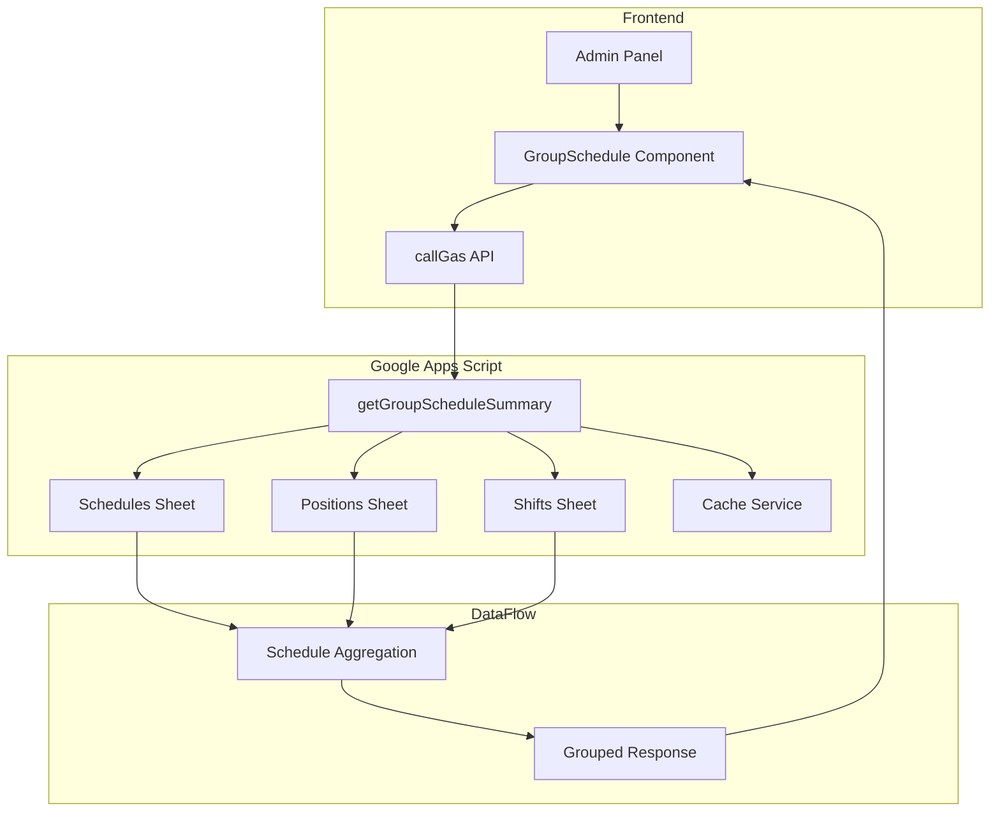
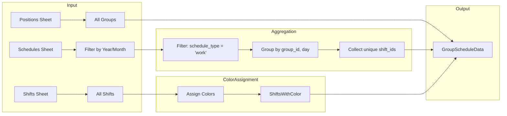

# Design Document: Group Schedule Feature

## Overview

The Group Schedule feature provides an alternative view of the monthly schedule, displaying groups (positions) instead of individual users. This view aggregates schedule data by group, showing which groups are assigned to which shifts on each day using colored dot indicators.

### Key Design Decisions

1. **Reuse Existing Data Sources**: Groups are derived from the existing Positions entity, and shift assignments are aggregated from the existing Schedules data. No new data storage is required.

2. **Consistent UI Patterns**: The Group Schedule view follows the same design patterns as the existing Monthly Schedule view (month navigation, sticky columns, weekend highlighting) for a consistent user experience.

3. **Server-Side Aggregation**: Schedule aggregation is performed on the backend to minimize data transfer and improve performance.

4. **Deterministic Color Assignment**: Colors are assigned to shifts using a deterministic algorithm based on shift ID, ensuring consistency across page loads and users.

---

## Architecture

### System Context



### Component Relationships

The Group Schedule feature integrates with the existing system as follows:

| Component | Relationship |
|-----------|-------------|
| `ScheduleManagement.js` | Sibling component - shares similar UI patterns and data sources |
| `PositionManagement.js` | Data source - provides group (position) definitions |
| `ShiftManagement.js` | Data source - provides shift definitions |
| `admin_partial.html` | Container - provides navigation and view container |
| `Schedule.gs` | Backend - provides data retrieval and caching |

---

## Components and Interfaces

### Frontend Components

#### GroupSchedule Class

**File**: `src/frontend/components/GroupSchedule.js`

```javascript
/**
 * GroupSchedule - Group-level schedule view for admin users
 * Displays a calendar grid with groups as rows and days as columns
 * Shows shift assignments using colored dot indicators
 */
class GroupSchedule {
    /**
     * @param {Object} state - Global application state
     * @param {Function} setState - State update function
     * @param {Function} callGas - Backend API call function
     */
    constructor(state, setState, callGas) {
        this.state = state;
        this.setState = setState;
        this.callGas = callGas;
        
        // View state
        this.year = new Date().getFullYear();
        this.month = new Date().getMonth() + 1; // 1-12
        this.filterGroup = '';    // Selected group ID or '' for all
        this.filterShift = '';    // Selected shift ID or '' for all
        this.loading = false;
        
        // Data
        this.groupScheduleData = null;
        // Structure: { groups, shifts, schedules, year, month }
        // groups: Array<{ id: string, name: string }>
        // shifts: Array<{ id: string, start_time: string, end_time: string, color: string }>
        // schedules: Array<{ groupId: string, day: number, shiftIds: string[] }>
    }
    
    // Public Methods
    async loadData(): Promise<void>
    render(): void
    
    // Private Methods
    _renderLoading(): void
    _renderError(message: string): void
    _renderGrid(): void
    _renderLegend(): void
    _attachListeners(): void
    _buildScheduleLookup(): Object
    _getShiftColor(shiftId: string): string
    _formatTime(timeString: string): string
    escHtml(str: string): string
    t(key: string): string
}
```

### Backend Functions

#### getGroupScheduleSummary

**File**: `backend/Schedule.gs`

```javascript
/**
 * Get aggregated group schedule data for a month
 * Admin-only endpoint
 * 
 * @param {string} token - Authentication token
 * @param {number} year - Year (e.g., 2024)
 * @param {number} month - Month (1-12)
 * @returns {Object} Response with structure:
 *   {
 *     status: "success" | "error",
 *     data: {
 *       groups: Array<{ id: string, name: string }>,
 *       shifts: Array<{ id: string, start_time: string, end_time: string, color: string }>,
 *       schedules: Array<{ groupId: string, day: number, shiftIds: string[] }>,
 *       year: number,
 *       month: number
 *     }
 *   }
 */
function getGroupScheduleSummary(token, year, month)
```

### Data Interfaces

#### GroupScheduleData

```typescript
interface GroupScheduleData {
    groups: Group[];
    shifts: ShiftWithColor[];
    schedules: GroupScheduleEntry[];
    year: number;
    month: number;
}

interface Group {
    id: string;
    name: string;
}

interface ShiftWithColor {
    id: string;
    start_time: string;  // Format: "HH:mm"
    end_time: string;    // Format: "HH:mm"
    color: string;       // Hex color code, e.g., "#2fb344"
}

interface GroupScheduleEntry {
    groupId: string;
    day: number;         // 1-31
    shiftIds: string[];  // Array of shift IDs assigned to this group on this day
}
```

---

## Data Models

### Existing Data Sources

The feature reuses existing data from the Google Sheets backend:

#### Schedules Sheet

| Column | Type | Description |
|--------|------|-------------|
| id | string | Unique schedule entry ID |
| employee_id | string | Employee reference |
| year | number | Year (e.g., 2024) |
| month | number | Month (1-12) |
| day | number | Day (1-31) |
| shift_id | string | Shift reference (may be empty) |
| group_id | string | Position/Group reference |
| schedule_type | string | "work" \| "off" \| "holiday" |
| notes | string | Optional notes |
| created_at | string | Timestamp |
| created_by | string | User ID |

#### Positions Sheet (Groups)

| Column | Type | Description |
|--------|------|-------------|
| id | string | Unique position/group ID |
| name | string | Display name (e.g., "Operations") |

#### Shifts Sheet

| Column | Type | Description |
|--------|------|-------------|
| id | string | Unique shift ID |
| start_time | string | Start time (e.g., "08:00") |
| end_time | string | End time (e.g., "16:00") |

### Aggregation Logic

The backend aggregates individual employee schedules into group-level data:

```
For each schedule entry in the selected month:
    IF schedule_type === "work" AND shift_id is not empty:
        Group by (group_id, day)
        Collect unique shift_ids for each group-day combination
```

### Data Flow Diagram



---

## Correctness Properties

*This section assesses whether property-based testing (PBT) is appropriate for this feature.*

### PBT Applicability Assessment

After analyzing the requirements, this feature is **NOT suitable for property-based testing** for the following reasons:

1. **UI Rendering**: The core functionality involves rendering a calendar grid with colored dots, which is UI-focused. Visual regression tests and snapshot tests are more appropriate.

2. **Aggregation Logic**: While the aggregation algorithm has testable properties, it is a simple grouping operation with no complex transformations. Example-based unit tests provide adequate coverage.

3. **External Dependencies**: The feature relies heavily on Google Sheets as a data store and CacheService for caching. These are infrastructure components best tested with integration tests.

4. **No Pure Functions with Complex Input Space**: The main operations are CRUD and aggregation, which don't have the complex input/output relationships that benefit from PBT's randomized testing approach.

### Testing Strategy

Since PBT is not applicable, the testing strategy focuses on:

1. **Unit Tests**: Test the aggregation algorithm, color assignment, and time formatting functions with example-based tests.

2. **Integration Tests**: Test the `getGroupScheduleSummary` backend function against mock or real Google Sheets data.

3. **UI Tests**: Test the rendering of the grid, legend, and filter controls using snapshot tests or visual regression tests.

4. **End-to-End Tests**: Test the complete flow from navigation to data display.

---

## Error Handling

### Error Categories

| Error Type | Scenario | User Message | Recovery Action |
|------------|----------|--------------|-----------------|
| Authentication | Invalid or expired token | "Session expired. Please log in again." | Redirect to login |
| Authorization | Non-admin user attempts access | "Access denied. Admin privileges required." | Redirect to dashboard |
| Network | API call fails | "Connection error. Please try again." | Show retry button |
| Data Not Found | No groups or shifts exist | "No groups found. Please add groups first." | Link to Group Management |
| Empty Data | No schedules for the month | "No schedules set for this month." | Display empty grid |
| Cache Error | Cache read/write failure | Silent - fall back to sheet data | Log error, continue |

### Error Response Format

```javascript
{
    status: "error",
    message: "Human-readable error message",
    code: "AUTHENTICATION_ERROR" | "AUTHORIZATION_ERROR" | "NETWORK_ERROR" | "DATA_ERROR"
}
```

### Frontend Error Handling

```javascript
async loadData() {
    if (this.loading) return;
    this.loading = true;
    this._renderLoading();
    
    try {
        const res = await this.callGas('getGroupScheduleSummary', this.state.token, this.year, this.month);
        
        if (res && res.status === 'success') {
            this.groupScheduleData = res.data;
            this.loading = false;
            this.render();
        } else if (res && res.code === 'AUTHORIZATION_ERROR') {
            this.setState({ errorMessage: res.message });
            // Navigate to dashboard
        } else {
            this.loading = false;
            this._renderError(res?.message || this.t('groupSchedule.failedToLoad'));
        }
    } catch (e) {
        this.loading = false;
        this._renderError(this.t('groupSchedule.connectionError'));
    }
}
```

---

## Testing Strategy

### Unit Tests

**Location**: `src/frontend/components/GroupSchedule.test.js`

#### Test Cases

1. **Color Assignment**
   - Given a shift ID, returns the correct color from the palette
   - Colors cycle through the palette when shift count exceeds palette size
   - Same shift ID always returns the same color (deterministic)

2. **Time Formatting**
   - Given "08:00:00", returns "08:00"
   - Given invalid input, returns empty string or original input

3. **Schedule Lookup Building**
   - Given schedule data, builds correct lookup map
   - Multiple shifts on same day are collected correctly
   - Empty schedules produce empty lookup

### Integration Tests

**Location**: `backend/Schedule.gs` (inline tests or separate test file)

#### Test Cases

1. **getGroupScheduleSummary**
   - Returns correct structure with groups, shifts, schedules
   - Filters schedules by year and month correctly
   - Aggregates shifts by group and day correctly
   - Only includes "work" type schedules with shift_id
   - Returns colors for each shift

2. **Cache Behavior**
   - First call retrieves from sheets
   - Subsequent calls retrieve from cache (within TTL)
   - Cache invalidation works after schedule modification

### UI Tests

**Location**: `src/frontend/components/GroupSchedule.test.js` (with DOM testing)

#### Test Cases

1. **Navigation**
   - Previous/next month buttons update year and month correctly
   - Month display shows correct month name and year

2. **Filtering**
   - Group filter shows only selected group
   - Shift filter highlights matching cells
   - Filters preserve month selection

3. **Rendering**
   - Grid displays correct number of rows (groups)
   - Grid displays correct number of columns (days in month)
   - Weekend days have distinct styling
   - Legend displays all shifts with colors
   - Colored dots have correct colors

### Accessibility Tests

#### Test Cases

1. **Keyboard Navigation**
   - All interactive elements are focusable
   - Tab order follows logical sequence

2. **Screen Reader Support**
   - Colored dots have aria-labels with shift information
   - Table uses semantic HTML (th, td)
   - Filter controls have associated labels

---

## Implementation Details

### Color Assignment Algorithm

The color assignment algorithm uses a predefined palette and assigns colors deterministically based on shift index:

```javascript
/**
 * Predefined color palette with distinct, accessible colors
 * Colors are ordered to maximize visual distinction
 */
const SHIFT_COLOR_PALETTE = [
    '#2fb344', // Green
    '#206bc4', // Blue
    '#f76707', // Orange
    '#d63939', // Red
    '#7c3aed', // Purple
    '#0891b2', // Cyan
    '#db2777', // Pink
    '#65a30d', // Lime
    '#0d9488', // Teal
    '#f59e0b'  // Amber
];

/**
 * Assign color to a shift based on its index
 * @param {number} index - Zero-based index in the shifts array
 * @returns {string} Hex color code
 */
function assignShiftColor(index) {
    return SHIFT_COLOR_PALETTE[index % SHIFT_COLOR_PALETTE.length];
}

/**
 * Build shifts array with colors assigned
 * @param {Array} shifts - Raw shifts from data source
 * @returns {Array} Shifts with color property added
 */
function buildShiftsWithColors(shifts) {
    return shifts.map((shift, index) => ({
        ...shift,
        color: assignShiftColor(index)
    }));
}
```

**Accessibility Considerations**:
- All colors in the palette meet WCAG AA contrast requirements (4.5:1) against white backgrounds
- Colors are ordered to maximize visual distinction between adjacent shifts
- For systems with more than 10 shifts, colors cycle, but the legend helps users differentiate

### Schedule Aggregation Algorithm

```javascript
/**
 * Aggregate schedules by group and day
 * @param {Array} schedules - Raw schedule entries
 * @param {number} year - Target year
 * @param {number} month - Target month
 * @returns {Array} Aggregated group schedule entries
 */
function aggregateGroupSchedules(schedules, year, month) {
    // Filter to target month and work schedules with shifts
    const filtered = schedules.filter(s => 
        s.year === year && 
        s.month === month && 
        s.scheduleType === 'work' && 
        s.shiftId && 
        s.shiftId !== ''
    );
    
    // Group by (groupId, day) and collect unique shiftIds
    const lookup = {};
    for (const s of filtered) {
        if (!s.groupId) continue;
        
        const key = `${s.groupId}_${s.day}`;
        if (!lookup[key]) {
            lookup[key] = {
                groupId: s.groupId,
                day: s.day,
                shiftIds: []
            };
        }
        
        // Add shift ID if not already present
        if (!lookup[key].shiftIds.includes(s.shiftId)) {
            lookup[key].shiftIds.push(s.shiftId);
        }
    }
    
    return Object.values(lookup);
}
```

### Caching Strategy

```javascript
const CACHE_KEY_GROUP_SCHEDULE = 'group_schedule_';

/**
 * Get cached group schedule data
 * @param {string} masterDbId - Master database ID
 * @param {number} year - Year
 * @param {number} month - Month
 * @returns {Object|null} Cached data or null
 */
function getCachedGroupSchedule(masterDbId, year, month) {
    try {
        const cacheKey = `${CACHE_KEY_GROUP_SCHEDULE}${year}_${month}`;
        const cached = CacheService.getScriptCache().get(cacheKey);
        if (cached) return JSON.parse(cached);
    } catch (e) {
        // Cache miss or error, fall through to data retrieval
    }
    return null;
}

/**
 * Cache group schedule data with 30-minute TTL
 */
function setCachedGroupSchedule(year, month, data) {
    try {
        const cacheKey = `${CACHE_KEY_GROUP_SCHEDULE}${year}_${month}`;
        CacheService.getScriptCache().put(cacheKey, JSON.stringify(data), 1800);
    } catch (e) {
        // Silently fail - caching is optional
    }
}

/**
 * Invalidate group schedule cache
 * Call this when schedules are modified
 */
function invalidateGroupScheduleCache() {
    try {
        // Invalidate all cached months (current, previous, next)
        const now = new Date();
        for (let offset = -1; offset <= 1; offset++) {
            const date = new Date(now.getFullYear(), now.getMonth() + offset, 1);
            const cacheKey = `${CACHE_KEY_GROUP_SCHEDULE}${date.getFullYear()}_${date.getMonth() + 1}`;
            CacheService.getScriptCache().remove(cacheKey);
        }
    } catch (e) {
        // Silently fail
    }
}
```

### Frontend Component Structure

```javascript
// src/frontend/components/GroupSchedule.js

import { t } from '../i18n/i18n.js';

export class GroupSchedule {
    constructor(state, setState, callGas) {
        this.state = state;
        this.setState = setState;
        this.callGas = callGas;
        
        this.year = new Date().getFullYear();
        this.month = new Date().getMonth() + 1;
        this.filterGroup = '';
        this.filterShift = '';
        this.loading = false;
        this.groupScheduleData = null;
    }
    
    async loadData() {
        if (this.loading) return;
        this.loading = true;
        this._renderLoading();
        
        try {
            const res = await this.callGas('getGroupScheduleSummary', this.state.token, this.year, this.month);
            
            if (res && res.status === 'success') {
                this.groupScheduleData = res.data;
                this.loading = false;
                this.render();
            } else {
                this.loading = false;
                this._renderError(res?.message || t('groupSchedule.failedToLoad'));
            }
        } catch (e) {
            this.loading = false;
            this._renderError(t('groupSchedule.connectionError'));
        }
    }
    
    render() {
        const container = document.getElementById('admin-view-group-schedule');
        if (!container) return;
        
        if (!this.groupScheduleData) {
            this.loadData();
            return;
        }
        
        const { groups, shifts, schedules } = this.groupScheduleData;
        const daysInMonth = new Date(this.year, this.month, 0).getDate();
        const days = Array.from({ length: daysInMonth }, (_, i) => i + 1);
        
        // Build schedule lookup: "groupId_day" -> shiftIds[]
        const schedLookup = this._buildScheduleLookup(schedules);
        
        // Apply filters
        let filteredGroups = groups || [];
        if (this.filterGroup) {
            filteredGroups = filteredGroups.filter(g => g.id === this.filterGroup);
        }
        
        const monthNames = t('employeeDashboard.months');
        
        container.innerHTML = `
        <div class="container-fluid">
            <!-- Header with navigation -->
            <div class="row mb-3 align-items-center">
                <div class="col">
                    <div class="page-pretitle">${t('adminPanel.management')}</div>
                    <h2 class="page-title">${t('groupSchedule.groupSchedule')}</h2>
                </div>
                <div class="col-auto d-flex gap-2">
                    <!-- Month navigation -->
                    <button class="btn btn-outline-secondary js-gs-prev-month">
                        <!-- Previous icon -->
                    </button>
                    <span class="btn btn-outline-secondary disabled fw-semibold">
                        ${monthNames[this.month - 1]} ${this.year}
                    </span>
                    <button class="btn btn-outline-secondary js-gs-next-month">
                        <!-- Next icon -->
                    </button>
                </div>
            </div>
            
            <!-- Filters -->
            <div class="card mb-3">
                <div class="card-body py-2">
                    <div class="row g-2 align-items-end">
                        <div class="col-md-4">
                            <label class="form-label mb-1 small">${t('groupSchedule.filterByGroup')}</label>
                            <select class="form-select form-select-sm js-gs-filter-group">
                                <option value="">${t('groupSchedule.allGroups')}</option>
                                ${(groups || []).map(g => `
                                    <option value="${this.escHtml(g.id)}" ${this.filterGroup === g.id ? 'selected' : ''}>
                                        ${this.escHtml(g.name)}
                                    </option>
                                `).join('')}
                            </select>
                        </div>
                        <div class="col-md-4">
                            <label class="form-label mb-1 small">${t('groupSchedule.filterByShift')}</label>
                            <select class="form-select form-select-sm js-gs-filter-shift">
                                <option value="">${t('groupSchedule.allShifts')}</option>
                                ${(shifts || []).map(s => `
                                    <option value="${this.escHtml(s.id)}" ${this.filterShift === s.id ? 'selected' : ''}>
                                        ${this.escHtml(this._formatTime(s.start_time))}–${this.escHtml(this._formatTime(s.end_time))}
                                    </option>
                                `).join('')}
                            </select>
                        </div>
                    </div>
                </div>
            </div>
            
            <!-- Calendar Grid -->
            <div class="card">
                <div class="card-body p-0">
                    <div class="table-responsive" style="max-height: 70vh; overflow: auto;">
                        <table class="table table-bordered table-sm mb-0 sched-table" style="min-width: ${120 + daysInMonth * 52}px;">
                            <thead class="table-light sticky-top">
                                <tr>
                                    <th class="sticky-col" style="min-width:160px; z-index:3;">
                                        ${t('groupSchedule.group')}
                                    </th>
                                    ${days.map(d => {
                                        const dow = new Date(this.year, this.month - 1, d).getDay();
                                        const isWeekend = dow === 0 || dow === 6;
                                        const dowLabel = t('employeeDashboard.daysShort')[dow];
                                        return `
                                            <th class="text-center ${isWeekend ? 'table-warning' : ''}" style="min-width:52px; font-size:11px;">
                                                <div>${d}</div>
                                                <div class="text-muted" style="font-size:10px;">${dowLabel}</div>
                                            </th>
                                        `;
                                    }).join('')}
                                </tr>
                            </thead>
                            <tbody>
                                ${filteredGroups.length === 0
                                    ? `<tr><td colspan="${daysInMonth + 1}" class="text-center text-muted py-4">${t('groupSchedule.noGroupsFound')}</td></tr>`
                                    : filteredGroups.map(group => `
                                        <tr>
                                            <td class="sticky-col fw-semibold" style="min-width:160px; background:#fff; z-index:2;">
                                                ${this.escHtml(group.name)}
                                            </td>
                                            ${days.map(d => {
                                                const key = `${group.id}_${d}`;
                                                const shiftIds = schedLookup[key] || [];
                                                const isFiltered = this.filterShift && !shiftIds.includes(this.filterShift);
                                                
                                                return `
                                                    <td class="text-center p-0 ${isFiltered ? 'opacity-25' : ''}" style="height:40px;">
                                                        <div class="d-flex align-items-center justify-content-center gap-1 flex-wrap px-1">
                                                            ${shiftIds.map(sid => {
                                                                const shift = (shifts || []).find(s => s.id === sid);
                                                                const color = shift?.color || '#6c757d';
                                                                return `
                                                                    <span 
                                                                        class="rounded-circle d-inline-block" 
                                                                        style="width:12px; height:12px; background-color:${color};"
                                                                        title="${this.escHtml(sid)}: ${shift ? this._formatTime(shift.start_time) + '–' + this._formatTime(shift.end_time) : ''}"
                                                                        aria-label="Shift ${this.escHtml(sid)}"
                                                                    ></span>
                                                                `;
                                                            }).join('')}
                                                        </div>
                                                    </td>
                                                `;
                                            }).join('')}
                                        </tr>
                                    `).join('')
                                }
                            </tbody>
                        </table>
                    </div>
                </div>
            </div>
            
            <!-- Legend -->
            <div class="card mt-3">
                <div class="card-body py-2">
                    <div class="row g-2 align-items-center">
                        <div class="col-auto">
                            <span class="text-muted small fw-semibold">${t('groupSchedule.legend')}</span>
                        </div>
                        <div class="col">
                            <div class="d-flex flex-wrap gap-3">
                                ${(shifts || []).map(s => `
                                    <div class="d-flex align-items-center gap-1">
                                        <span 
                                            class="rounded-circle d-inline-block" 
                                            style="width:12px; height:12px; background-color:${s.color};"
                                        ></span>
                                        <span class="small">
                                            ${this.escHtml(this._formatTime(s.start_time))}–${this.escHtml(this._formatTime(s.end_time))}
                                        </span>
                                    </div>
                                `).join('')}
                            </div>
                        </div>
                    </div>
                </div>
            </div>
        </div>`;
        
        this._attachListeners();
    }
    
    _buildScheduleLookup(schedules) {
        const lookup = {};
        for (const s of (schedules || [])) {
            const key = `${s.groupId}_${s.day}`;
            lookup[key] = s.shiftIds;
        }
        return lookup;
    }
    
    _formatTime(str) {
        if (!str) return '';
        const m = String(str).match(/\d{2}:\d{2}/);
        return m ? m[0] : str;
    }
    
    _renderLoading() {
        const container = document.getElementById('admin-view-group-schedule');
        if (!container) return;
        container.innerHTML = `
        <div class="container-fluid">
            <div class="d-flex justify-content-center align-items-center py-5">
                <div class="spinner-border text-primary me-3"></div>
                <span class="text-muted">${t('groupSchedule.loading')}</span>
            </div>
        </div>`;
    }
    
    _renderError(msg) {
        const container = document.getElementById('admin-view-group-schedule');
        if (!container) return;
        container.innerHTML = `
        <div class="container-fluid">
            <div class="alert alert-danger">${this.escHtml(msg)}</div>
            <button class="btn btn-primary js-gs-reload">${t('retry') || 'Retry'}</button>
        </div>`;
        container.querySelector('.js-gs-reload')?.addEventListener('click', () => this.loadData());
    }
    
    _attachListeners() {
        const container = document.getElementById('admin-view-group-schedule');
        if (!container) return;
        
        // Month navigation
        container.querySelector('.js-gs-prev-month')?.addEventListener('click', () => {
            this.month--;
            if (this.month < 1) { this.month = 12; this.year--; }
            this.groupScheduleData = null;
            this.loadData();
        });
        
        container.querySelector('.js-gs-next-month')?.addEventListener('click', () => {
            this.month++;
            if (this.month > 12) { this.month = 1; this.year++; }
            this.groupScheduleData = null;
            this.loadData();
        });
        
        // Filters
        container.querySelector('.js-gs-filter-group')?.addEventListener('change', e => {
            this.filterGroup = e.target.value;
            this.render();
        });
        
        container.querySelector('.js-gs-filter-shift')?.addEventListener('change', e => {
            this.filterShift = e.target.value;
            this.render();
        });
    }
    
    escHtml(str) {
        if (str === null || str === undefined) return '';
        return String(str)
            .replace(/&/g, '&amp;')
            .replace(/</g, '&lt;')
            .replace(/>/g, '&gt;')
            .replace(/"/g, '&quot;')
            .replace(/'/g, '&#x27;');
    }
    
    t(key) {
        return t(key);
    }
}
```

---

## Navigation Integration

### Admin Sidebar Addition

Add the following navigation item in `backend/admin_partial.html` after the "Monthly Schedule" item:

```html
<div class="admin-sidebar-item admin-sidebar-subitem" data-view="group-schedule" id="nav-group-schedule">
    <svg xmlns="http://www.w3.org/2000/svg" class="icon" width="20" height="20" viewBox="0 0 24 24" stroke-width="2" stroke="currentColor" fill="none" stroke-linecap="round" stroke-linejoin="round">
        <path stroke="none" d="M0 0h24v24H0z" fill="none"/>
        <path d="M4 5m0 2a2 2 0 0 1 2 -2h12a2 2 0 0 1 2 2v12a2 2 0 0 1 -2 2h-12a2 2 0 0 1 -2 -2z" />
        <path d="M16 3l0 4" />
        <path d="M8 3l0 4" />
        <path d="M4 11l16 0" />
        <path d="M8 15h2v2h-2z" />
        <path d="M14 15h2v2h-2z" />
    </svg>
    <span data-i18n="adminPanel.groupSchedule">Group Schedule</span>
</div>
```

### View Container

Add the view container in `backend/admin_partial.html`:

```html
<!-- Group Schedule View -->
<div id="admin-view-group-schedule" style="display: none;">
    <!-- Content will be rendered by the GroupSchedule component -->
</div>
```

---

## Internationalization

### New Translation Keys

Add the following keys to `src/frontend/i18n/languages.js`:

```javascript
// English
groupSchedule: {
    groupSchedule: 'Group Schedule',
    group: 'Group',
    filterByGroup: 'Filter by Group',
    filterByShift: 'Filter by Shift',
    allGroups: 'All Groups',
    allShifts: 'All Shifts',
    legend: 'Legend',
    loading: 'Loading group schedule...',
    failedToLoad: 'Failed to load group schedule.',
    connectionError: 'Connection error while loading group schedule.',
    noGroupsFound: 'No groups found. Please add groups in Group Management.',
    noSchedulesForMonth: 'No schedules set for this month.'
}

// Add to adminPanel object
adminPanel: {
    // ... existing keys ...
    groupSchedule: 'Group Schedule',
}
```

```javascript
// Bahasa Indonesia
groupSchedule: {
    groupSchedule: 'Jadwal Grup',
    group: 'Grup',
    filterByGroup: 'Filter berdasarkan Grup',
    filterByShift: 'Filter berdasarkan Shift',
    allGroups: 'Semua Grup',
    allShifts: 'Semua Shift',
    legend: 'Legenda',
    loading: 'Memuat jadwal grup...',
    failedToLoad: 'Gagal memuat jadwal grup.',
    connectionError: 'Kesalahan koneksi saat memuat jadwal grup.',
    noGroupsFound: 'Tidak ada grup ditemukan. Silakan tambahkan grup di Manajemen Grup.',
    noSchedulesForMonth: 'Tidak ada jadwal untuk bulan ini.'
}
```

---

## CSS Considerations

The Group Schedule component reuses existing CSS from `src/frontend/style.css`:

```css
/* Existing styles used by Group Schedule */
.sched-table .sticky-col {
    position: sticky;
    left: 0;
    z-index: 2;
    background: #fff;
}

.table-responsive {
    overflow-x: auto;
    -webkit-overflow-scrolling: touch;
}

/* Additional styles for colored dots */
.group-schedule-dot {
    width: 12px;
    height: 12px;
    border-radius: 50%;
    display: inline-block;
}
```

---

## Cache Invalidation

The group schedule cache must be invalidated when schedule data changes. Update the following functions in `backend/Schedule.gs`:

```javascript
function saveBulkSchedule(token, entries) {
    // ... existing code ...
    invalidateSchedulesCache();
    invalidateGroupScheduleCache();  // Add this line
    // ... rest of function ...
}

function deleteScheduleEntry(token, scheduleId) {
    // ... existing code ...
    invalidateSchedulesCache();
    invalidateGroupScheduleCache();  // Add this line
    // ... rest of function ...
}

function saveScheduleEntry(token, scheduleData) {
    // ... existing code ...
    invalidateSchedulesCache();
    invalidateGroupScheduleCache();  // Add this line
    // ... rest of function ...
}
```

---

## Summary

The Group Schedule feature adds a new admin view that displays schedule data aggregated by group (position). Key implementation points:

1. **Backend**: Add `getGroupScheduleSummary` function to `backend/Schedule.gs` with caching support
2. **Frontend**: Create `GroupSchedule.js` component following the pattern of `ScheduleManagement.js`
3. **Navigation**: Add navigation item and view container to `admin_partial.html`
4. **Internationalization**: Add translation keys to `languages.js`
5. **Caching**: Implement 30-minute TTL cache with invalidation on schedule changes
6. **Color Assignment**: Use deterministic algorithm with predefined accessible color palette
