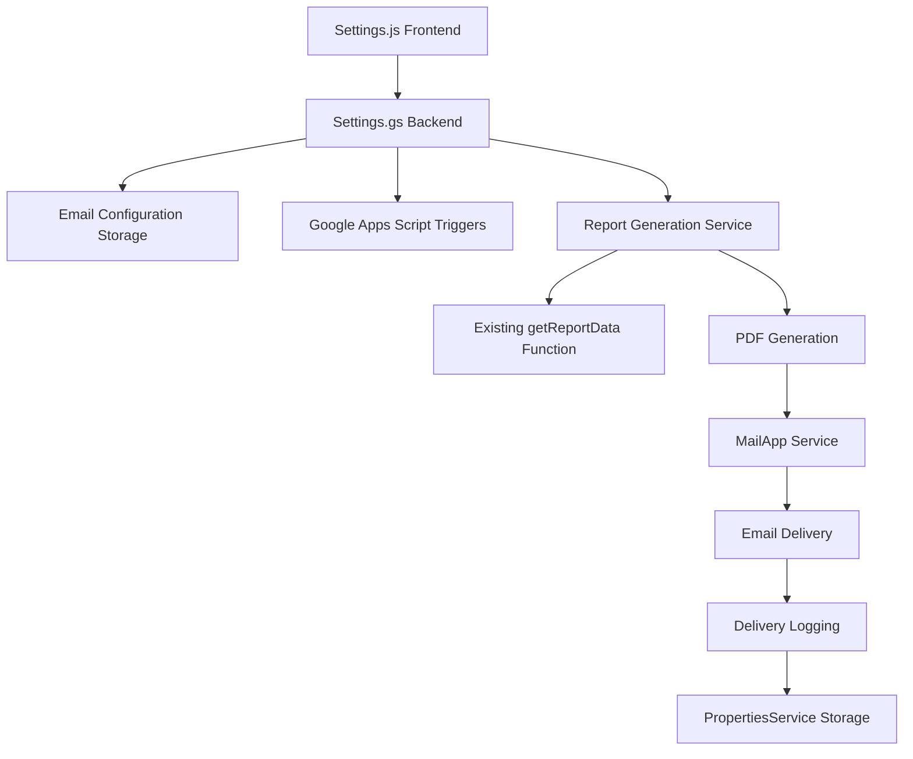

# Design Document: Scheduled Monthly Report Email Feature

## Overview

This design document outlines the technical implementation for the scheduled monthly report email feature in the Google Apps Script attendance management system. The feature enables automatic generation and delivery of PDF monthly attendance reports via email at configurable schedules.

The system extends the existing Settings.gs backend and Settings.js frontend components to provide email configuration management, integrates with Google Apps Script's time-based triggers for scheduling, and leverages the existing report generation infrastructure to create PDF attachments.

### Key Components

- **Email Configuration Management**: Admin interface for configuring recipient email and schedule
- **Report Generation Service**: PDF creation from monthly attendance data (excluding stat cards)
- **Email Scheduler**: Time-based trigger management for automated delivery
- **Delivery Logging**: Tracking and display of email delivery attempts
- **Manual Sending**: On-demand report generation and delivery

## Architecture

### System Integration Points

The scheduled email feature integrates with existing system components:



### Data Flow

1. **Configuration Phase**: Admin configures email settings through Settings.js UI
2. **Storage Phase**: Settings.gs stores configuration in PropertiesService
3. **Scheduling Phase**: Time-based triggers are created/updated based on schedule
4. **Execution Phase**: Trigger fires, generates report, sends email, logs result
5. **Monitoring Phase**: Admin views delivery logs through Settings UI

## Components and Interfaces

### Frontend Component Extensions (Settings.js)

The existing Settings.js component will be extended with a new "Monthly Report Email" section:

```javascript
// New section in Settings.js render method
<div class="col-12">
    <div class="card">
        <div class="card-header">
            <h3 class="card-title">
                <svg>...</svg>
                Monthly Report Email
            </h3>
        </div>
        <div class="card-body">
            <!-- Email configuration form -->
            <!-- Schedule configuration -->
            <!-- Manual send button -->
            <!-- Delivery logs display -->
        </div>
    </div>
</div>
```

#### New Methods in Settings.js

- `loadEmailSettings()`: Fetch current email configuration
- `handleEmailSettingsSave(e)`: Save email configuration
- `handleManualSend()`: Trigger manual report sending
- `loadDeliveryLogs()`: Fetch and display recent delivery attempts

### Backend Service Extensions (Settings.gs)

New functions to be added to Settings.gs:

```javascript
// Email configuration management
function getEmailSettings(token)
function saveEmailSettings(token, emailData)

// Report generation and sending
function generateMonthlyReportPDF(month, year)
function sendMonthlyReportEmail(recipientEmail, pdfBlob, month, year)
function sendManualMonthlyReport(token)

// Trigger management
function setupEmailScheduleTrigger(day, hour, minute)
function removeEmailScheduleTrigger()

// Delivery logging
function logEmailDelivery(recipient, month, year, status, error)
function getEmailDeliveryLogs(token)

// Scheduled execution handler
function handleScheduledEmailSend()
```

### Email Configuration Data Model

Email settings stored in PropertiesService:

```javascript
{
  MONTHLY_EMAIL_ENABLED: "true|false",
  MONTHLY_EMAIL_RECIPIENT: "admin@company.com",
  MONTHLY_EMAIL_SCHEDULE_DAY: "5",        // 1-28
  MONTHLY_EMAIL_SCHEDULE_HOUR: "9",       // 0-23
  MONTHLY_EMAIL_SCHEDULE_MINUTE: "0",     // 0-59
  MONTHLY_EMAIL_TRIGGER_ID: "trigger_id"  // For trigger management
}
```

### Delivery Log Data Model

Delivery logs stored in a dedicated spreadsheet sheet:

```javascript
// Email_Delivery_Log sheet columns:
[
  "timestamp",      // Date/time of delivery attempt
  "recipient",      // Email address
  "month_year",     // "2024-01" format
  "status",         // "success" | "failed"
  "error_message",  // Error details if failed
  "trigger_type"    // "scheduled" | "manual"
]
```

## Data Models

### Email Settings Configuration

```typescript
interface EmailSettings {
  enabled: boolean;           // Enable/disable automatic emails
  recipient: string;          // Email address for reports
  scheduleDay: number;        // Day of month (1-28)
  scheduleHour: number;       // Hour of day (0-23)
  scheduleMinute: number;     // Minute of hour (0-59)
  triggerId?: string;         // Current trigger ID
}
```

### Monthly Report Data Structure

The report generation will use the existing `getReportData` function with "monthly" period:

```typescript
interface MonthlyReportData {
  reportData: Array<{
    employeeId: string;
    employeeName: string;
    position: string;
    onTime: number;
    late: number;
    absent: number;
    totalDays: number;
  }>;
  summary: {
    totalOnTime: number;
    totalLate: number;
    totalAbsent: number;
  };
}
```

### Email Delivery Log Entry

```typescript
interface DeliveryLogEntry {
  timestamp: string;          // ISO datetime string
  recipient: string;          // Email address
  monthYear: string;          // "YYYY-MM" format
  status: "success" | "failed";
  errorMessage?: string;      // Present if status is "failed"
  triggerType: "scheduled" | "manual";
}
```

## Error Handling

### Email Configuration Validation

- **Email Format**: Validate using regex pattern `/^[^\s@]+@[^\s@]+\.[^\s@]+$/`
- **Schedule Day**: Must be integer between 1-28 (ensures valid for all months)
- **Schedule Time**: Hour (0-23), Minute (0-59)
- **Recipient Required**: Cannot be empty when enabling automatic emails

### Report Generation Error Handling

- **No Data Available**: Generate report with "No attendance data available" message
- **Data Access Errors**: Log error and send notification email to admin
- **PDF Generation Failures**: Retry once, then log failure

### Email Delivery Error Handling

- **Invalid Recipient**: Log error, disable automatic sending
- **Quota Exceeded**: Log error with retry timestamp
- **Network Failures**: Retry up to 3 times with exponential backoff
- **Attachment Size Limits**: Compress or split large reports

### Trigger Management Error Handling

- **Trigger Creation Failures**: Log error, provide manual alternative
- **Trigger Deletion Failures**: Log warning, continue with new trigger creation
- **Multiple Triggers**: Clean up duplicate triggers automatically

## Error Handling

### Email Configuration Validation

- **Email Format**: Validate using regex pattern `/^[^\s@]+@[^\s@]+\.[^\s@]+$/`
- **Schedule Day**: Must be integer between 1-28 (ensures valid for all months)
- **Schedule Time**: Hour (0-23), Minute (0-59)
- **Recipient Required**: Cannot be empty when enabling automatic emails

### Report Generation Error Handling

- **No Data Available**: Generate report with "No attendance data available" message
- **Data Access Errors**: Log error and send notification email to admin
- **PDF Generation Failures**: Retry once, then log failure

### Email Delivery Error Handling

- **Invalid Recipient**: Log error, disable automatic sending
- **Quota Exceeded**: Log error with retry timestamp
- **Network Failures**: Retry up to 3 times with exponential backoff
- **Attachment Size Limits**: Compress or split large reports

### Trigger Management Error Handling

- **Trigger Creation Failures**: Log error, provide manual alternative
- **Trigger Deletion Failures**: Log warning, continue with new trigger creation
- **Multiple Triggers**: Clean up duplicate triggers automatically

## Testing Strategy

### Dual Testing Approach

- **Unit tests**: Verify specific examples, edge cases, and error conditions
- **Property tests**: Verify universal properties across all inputs (for applicable functions)
- **Integration tests**: Verify external service integration and end-to-end workflows
- Together: comprehensive coverage (unit tests catch concrete bugs, property tests verify general correctness, integration tests validate service interactions)

### Property-Based Testing Configuration

For the properties identified above, the following configuration will be used:

- **Minimum 100 iterations** per property test (due to randomization)
- **Test Library**: Use Google Apps Script compatible testing framework or custom implementation
- **Tag Format**: Each property test tagged with **Feature: scheduled-monthly-report-email, Property {number}: {property_text}**

### Unit Testing Focus Areas

**Email Configuration Functions**:
- Test email format validation with valid/invalid addresses
- Test schedule validation with boundary values (1-28 days, 0-23 hours)
- Test configuration persistence and retrieval

**Report Generation Functions**:
- Test PDF generation with sample data
- Test handling of empty data sets
- Test month/year parameter validation

**Email Delivery Functions**:
- Test email composition with various data sets
- Test attachment handling
- Test error scenarios (invalid recipients, quota limits)

**Trigger Management Functions**:
- Test trigger creation with various schedules
- Test trigger cleanup and replacement
- Test trigger execution handler

### Integration Testing Focus Areas

**End-to-End Email Flow**:
1. Configure email settings through UI
2. Verify trigger creation
3. Manually execute trigger function
4. Verify email delivery and logging

**Settings UI Integration**:
1. Test form validation and submission
2. Test manual send functionality
3. Test delivery log display
4. Test enable/disable toggle behavior

**External Service Integration**:
1. Google Apps Script trigger creation and execution
2. MailApp/GmailApp email delivery
3. PropertiesService data persistence
4. Spreadsheet-based logging

### Testing Limitations

Due to the significant external service dependencies (Gmail, time-based triggers, Google Drive), comprehensive automated testing will require:
- Mock implementations for external services during unit testing
- Sandbox environment for integration testing
- Manual verification for production email delivery

## Correctness Properties

*A property is a characteristic or behavior that should hold true across all valid executions of a system-essentially, a formal statement about what the system should do. Properties serve as the bridge between human-readable specifications and machine-verifiable correctness guarantees.*

After analyzing the acceptance criteria, several properties can be validated through property-based testing, while others require example-based or integration testing approaches.

### Property Reflection

Upon reviewing the identified properties, several can be consolidated to eliminate redundancy:

- Email validation properties (1.2, 1.4) can be combined into a comprehensive email validation property
- Storage round-trip properties (1.3, 2.5, 5.4, 7.5) can be consolidated into a general configuration persistence property
- Schedule validation properties (2.2, 2.6, 2.7) can be combined into comprehensive schedule validation
- Report content properties (3.2, 3.4, 3.5) can be consolidated into a comprehensive report completeness property
- Logging properties (7.1, 7.2, 7.3) can be combined into a comprehensive delivery logging property

### Property 1: Email Format Validation

*For any* string input, the email validation function should return true if and only if the string matches valid email format (contains @ symbol, has domain part, no whitespace)

**Validates: Requirements 1.2, 1.4**

### Property 2: Configuration Persistence Round-Trip

*For any* valid configuration data (email settings, schedule settings, enabled state), storing the configuration and then retrieving it should return equivalent values

**Validates: Requirements 1.3, 2.5, 5.4, 7.5**

### Property 3: Schedule Validation Completeness

*For any* schedule input, validation should accept day values 1-28, hour values 0-23, minute values 0-59, and reject all values outside these ranges

**Validates: Requirements 2.2, 2.6, 2.7**

### Property 4: Month Boundary Handling

*For any* month and day combination where the day exceeds the days in that month, the system should use the last valid day of that month

**Validates: Requirements 2.4**

### Property 5: Report Content Completeness

*For any* valid monthly attendance data set, the generated report should include all employees, their attendance counts, summary statistics, proper headers, organization name, and month/year labels

**Validates: Requirements 3.2, 3.4, 3.5**

### Property 6: Report Content Filtering

*For any* report generation request, the resulting PDF should exclude stat cards data while including all other attendance summary data

**Validates: Requirements 3.3**

### Property 7: Email Composition Consistency

*For any* month/year combination, the email subject should include both the month and year, and the email body should contain explanatory text about the attachment

**Validates: Requirements 4.5, 4.6**

### Property 8: Error Logging Completeness

*For any* email delivery attempt (successful or failed), a log entry should be created with timestamp, recipient, month/year, status, and error details (if applicable)

**Validates: Requirements 4.7, 7.1, 7.2, 7.3**

### Property 9: UI State Consistency

*For any* enabled/disabled state of the email feature, the settings interface should display the current status accurately

**Validates: Requirements 5.5**

### Property 10: Manual Send Independence

*For any* enabled/disabled state of automatic emails, manual sending should function correctly and display appropriate success/error messages

**Validates: Requirements 6.4, 6.5**

### Property 11: Log Display Content Completeness

*For any* delivery log entry, when displayed in the UI, it should show timestamp, recipient, month/year, and delivery status

**Validates: Requirements 7.6**

The majority of testing will rely on unit tests for specific scenarios and integration tests for the complete email delivery workflow, with property-based tests validating the core logic functions identified above.
